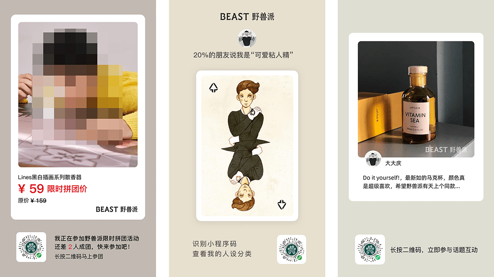
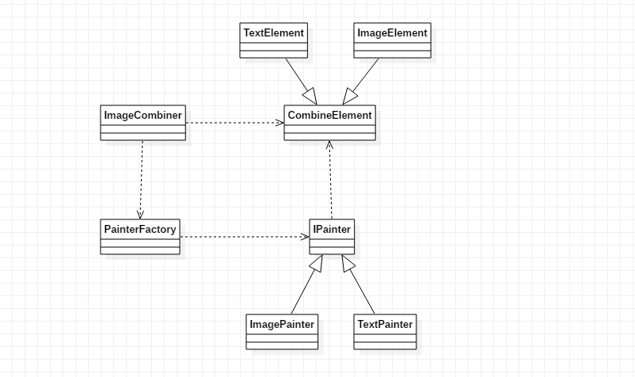
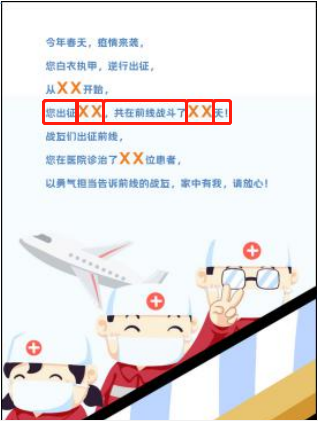
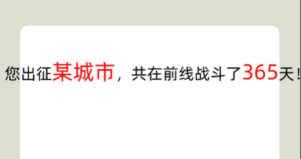
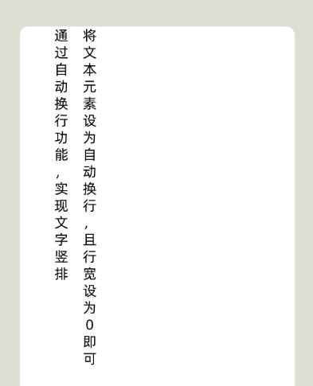
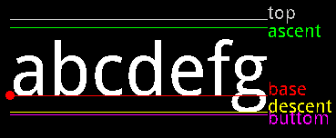
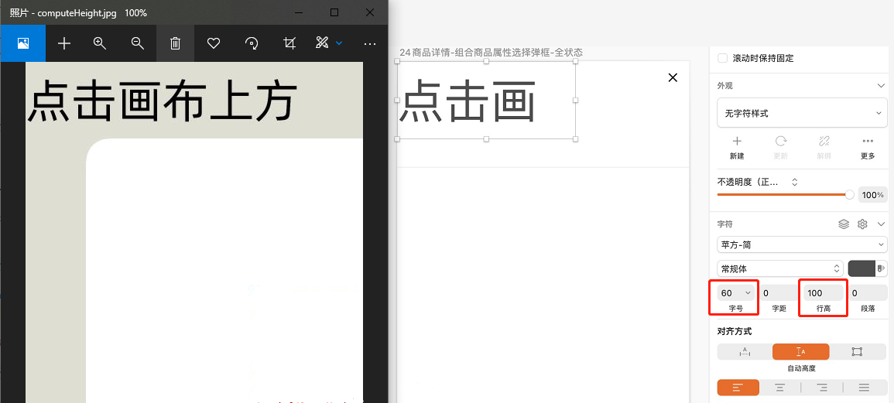
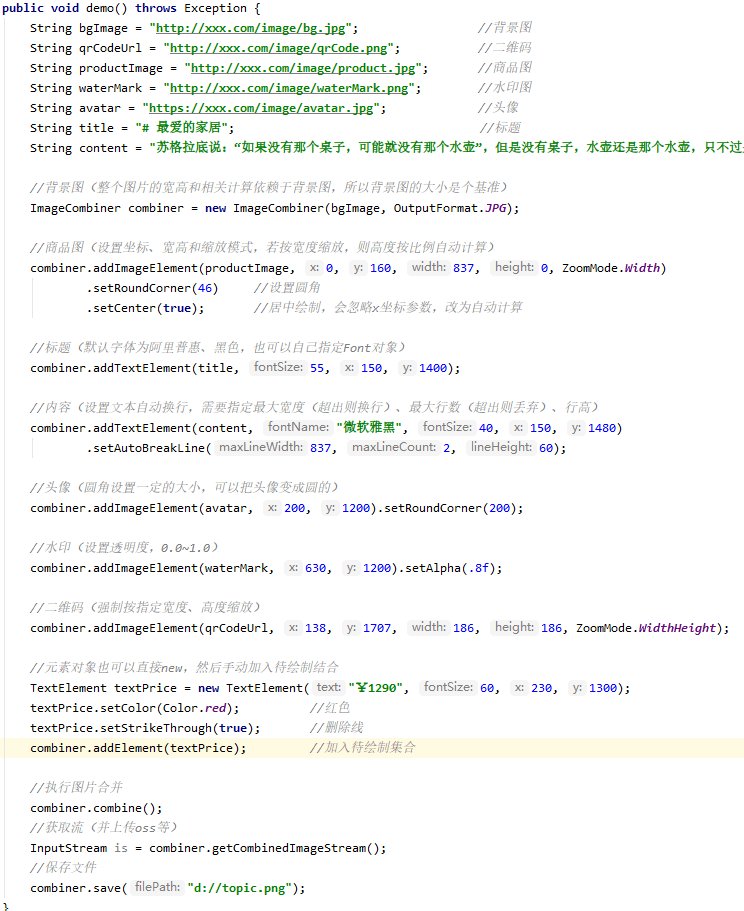

# 一. 新手介绍

## 1.1 项目背景

最近公司上了不少传播方面的需求，免不了合成各种营销图片，图片合成本身并不是什么高深的技术，但用底层api去搞确实繁琐，于是抽时间封装了一个小工具，初衷是解放生产力，后来发现挺好使，那就开源吧，花了一个整天重新整理了一下代码，作为自己从业十年第一个开源项目（打破零记录，哈哈），希望能够帮助到需要的小伙伴~

## 1.2 ImageCombiner能够做什么?

ImageCombiner是一个专门用于Java服务端图片合成的工具，没有很复杂的功能，简单实用，从实际业务场景出发，提供简单的接口，几行代码即可实现图片拼合（当然用于合成水印也可以），素材上支持图片、文本、矩形三种，支持定位、缩放、旋转、圆角、透明度、颜色、字体、字号、删除线、居中绘制、文本自动换行等特性，足够覆盖图片合成的日常需求。

## 1.3 先看一下效果


> 专门开了一个作品搜集&展示的issue，可以秀一秀成果，顺带分享下思路~
>
> <https://gitee.com/dromara/image-combiner/issues/I4FVGB>


## 1.4 UML


## 1.5 ImageCombiner怎么使用

ImageCombiner使用起来相当简单，主要的类只用一个，new一个ImageCombiner对象，指定背景图片和输出格式，然后加入各种素材元素，设置元素的位置、大小和效果（如圆角、颜色、透明度等），调用combine()方法即可。combine()方法直接返回BufferedImage对象，也可以调用getCombinedImageStream()获得流，方便上传oss等后续操作，或者调用save()方法保存到本地，调试的时候比较方便。

## 1.6 版本要求

项目不依赖任何框架，完全基于JDK本身编写，没有各种花里胡哨的东西，性能还是相当不错的。

# 二. 示例代码

## 2.1 安装
注意：合成图片若包含文字的话，开发机和服务器要先安装相应的字体，否则看不出效果，默认使用的字体为“阿里巴巴普惠体”（见font目录）。

PS：一些小伙伴反应安装了字体后仍然看不出效果，这多数是因为实际的字体名称跟你看到的文件名是不一样的，可以跑一下测试项目里的showFonts()方法，打印出系统可用字体列表，找一找你刚安装的字体的真实的名字。

在项目中加入以下依赖：
```xml
<dependency>
    <groupId>com.freewayso</groupId>
    <artifactId>image-combiner</artifactId>
    <version>2.4.1</version>
</dependency>
```

## 2.2 最简单的例子
```java
public void simpleDemo() throws Exception {

    //合成器（指定背景图和输出格式，整个图片的宽高和相关计算依赖于背景图，所以背景图的大小是个基准）
    ImageCombiner combiner = new ImageCombiner("http://xxx.com/image/bg.jpg", OutputFormat.JPG);

    //加图片元素
    combiner.addImageElement("http://xxx.com/image/product.png", 0, 300);

    //加文本元素
    combiner.addTextElement("周末大放送", 60, 100, 960);

    //执行图片合并
    combiner.combine();

    //可以获取流（并上传oss等）
    InputStream is = combiner.getCombinedImageStream();

    //也可以保存到本地
    //combiner.save("d://image.jpg");
```

## 2.3 完整示例

```java
public void demo() throws Exception {

    //图片元素可以是Url，也可以是BufferImage对象
    String bgImageUrl = "http://xxx.com/image/bg.jpg";                  //背景图
    String qrCodeUrl = "http://xxx.com/image/qrCode.png";               //二维码
    String productImageUrl = "http://xxx.com/image/product.jpg";        //商品图
    BufferedImage waterMark = ImageIO.read(new URL("https://xxx.com/image/waterMark.jpg")); //水印图
    BufferedImage avatar = ImageIO.read(new URL("https://xxx.com/image/avatar.jpg"));       //头像
    String title = "# 最爱的家居";                                       //标题文本
    String content = "苏格拉底说：“如果没有那个桌子，可能就没有那个水壶”";  //内容文本

    //创建合成器（指定背景图和输出格式，整个图片的宽高和相关计算依赖于背景图，所以背景图的大小是个基准）
    ImageCombiner combiner = new ImageCombiner(bgImageUrl, 1500, 0, ZoomMode.Height, OutputFormat.JPG);  //v1.1.4之后可以指定背景图新宽高了（不指定则默认用图片原宽高）
    
    //针对背景和整图的设置
    combiner.setBackgroundBlur(30);     //设置背景高斯模糊（毛玻璃效果）
    combiner.setCanvasRoundCorner(100); //设置整图圆角（输出格式必须为PNG）
    
    //标题（默认字体为阿里普惠、黑色，也可以自己指定Font对象）
    combiner.addTextElement(title, 0, 150, 1400)
            .setCenter(true)        //居中绘制（会忽略x坐标，改为自动计算）
            .setAlpha(.8f)          //透明度（0.0~1.0）
            .setRotate(45)          //旋转（0~360）
            .setColor(Color.Red)    //颜色
            .setDirection(Direction.RightLeft); //绘制方向（从右到左，用于需要右对齐场景）

    //内容（设置文本自动换行，需要指定最大宽度（超出则换行）、最大行数（超出则丢弃）、行高）
    combiner.addTextElement(content, "微软雅黑", Font.BOLD, 40, 150, 1480)
            .setSpace(.5f)                      //字间距
            .setStrikeThrough(true)             //删除线
            .setAutoBreakLine(837, 2, 60);      //自动换行（还有一个LineAlign参数可以指定对齐方式）

    //商品图（设置坐标、宽高和缩放模式，若按宽度缩放，则高度按比例自动计算）
    combiner.addImageElement(productImageUrl, 0, 160, 837, 0, ZoomMode.Width)
            .setCenter(true)        //居中绘制（会忽略x坐标，改为自动计算）
            .setRoundCorner(46)     //设置圆角

    //头像（圆角设置一定的大小，可以把头像变成圆的）
    combiner.addImageElement(avatar, 200, 1200)
            .setRoundCorner(200);   //圆角

    //水印（设置透明度，0.0~1.0）
    combiner.addImageElement(waterMark, 630, 1200)
            .setAlpha(.8f)          //透明度（0.0~1.0）
            .setRotate(45)          //旋转（0~360）
            .setBlur(20)            //高斯模糊(1~100)
            .setRepeat(true, 100, 50)    //平铺绘制（可设置水平、垂直间距）

    //加入圆角矩形元素（版本>=1.2.0），作为二维码的底衬
    combiner.addRectangleElement(138, 1707, 300, 300)
            .setColor(Color.WHITE)
            .setRoundCorner(50)     //该值大于等于宽高时，就是圆形，如设为300
            .setAlpha(.8f)
            .setGradient(Color.yellow,Color.blue,GradientDirection.LeftRight);  //颜色渐变
            .setBorderSize(5);      //设置border大小就是空心，不设置就是实心

    //二维码（强制按指定宽度、高度缩放）
    combiner.addImageElement(qrCodeUrl, 138, 1707, 186, 186, ZoomMode.WidthHeight);

    //价格（元素对象也可以直接new，然后手动加入待绘制列表）
    TextElement textPrice = new TextElement("￥1290", 60, 230, 1300);
    textPrice.setColor(Color.red);          //红色
    textPrice.setStrikeThrough(true);       //删除线
    combiner.addElement(textPrice);         //加入待绘制集合

    //执行图片合并
    combiner.combine();

    //可以获取流（并上传oss等）
    InputStream is = combiner.getCombinedImageStream();

    //也可以保存到本地
    //combiner.save("d://image.jpg");
}
```

更多示例请参见项目测试方法，[传送门](https://gitee.com/dromara/image-combiner/blob/master/src/test/java/com/freewayso/AppTest.java)

## 2.4 小技巧

### 2.4.1 如何动态拼接文本
实际需求中，经常会在一段固定文案里，填充宽度不定的文本或数字（如用户昵称、价格等），那中间待填充的空白部分留多少合适呢？
在这个场景下，我们一般会把一行文案拆分成多段，构建多个TextElement，共同拼成一句话，后一个TextElement的x坐标，
通过动态计算前一个TextElement的实际宽度后，累加得来。

以下例子中，我们以“您出征XX，共在前线战斗了XX天！”这行为例，
由于两个XX都是调用时传进来的参数，实际绘制宽度不固定，所以我们把这一行切分成5段，用5个TextElement动态计算位置，然后拼接起来。



```java
public void dynamicWidthDemoTest() throws Exception {
        String bg = "http://xxx.com/image/bg.jpg";
        ImageCombiner combiner = new ImageCombiner(bg, OutputFormat.JPG);

        String str1 = "您出征";
        String str2 = "某城市";     //外部传参，内容不定，宽度也不定
        String str3 = "，共在前线战斗了";
        String str4 = "365";       //外部传参，内容不定，宽度也不定
        String str5 = "天！";
        int fontSize = 60;
        int xxxFontSize = 80;

        int offsetX = 20;   //通过计算前一个元素的实际宽度，并累加这个偏移量，得到后一个元素正确的x坐标值
        int y = 300;

        //第一段
        TextElement element1 = combiner.addTextElement(str1, fontSize, offsetX, y);
        offsetX += element1.getWidth();     //计算宽度，并累加偏移量

        //第二段（内容不定，宽度也不定）
        TextElement element2 = combiner.addTextElement(str2, xxxFontSize, offsetX, y)
                .setColor(Color.red);
        offsetX += element2.getWidth();

        //第三段
        TextElement element3 = combiner.addTextElement(str3, fontSize, offsetX, y);
        offsetX += element3.getWidth();

        //第四段（内容不定，宽度也不定）
        TextElement element4 = combiner.addTextElement(str4, xxxFontSize, offsetX, y)
                .setColor(Color.red);
        offsetX += element4.getWidth();

        //第五段
        combiner.addTextElement(str5, fontSize, offsetX, y);

        combiner.combine();
        combiner.save("d://demo.jpg");
    }
```
实际运行效果



动态计算高度也是同样的原理，比方要把价格显示在商品描述下面，但商品描述不定有多少行，那此时价格元素的y坐标就是不确定的，可以通过调用textElement.getHeight()方法，得到上一个元素的高度，累加计算后续元素的y坐标。

### 2.4.2 如何文字竖排
graphics2D没有直接的竖排方法，本项目也未做封装，不过可以变相通过自动换行特性来实现，只要将textElement设置为自动换行，且行宽设为0即可（v2.3.8以下版本，要设为大于1个字符且小于2个字符的宽度），行间距可以通过行高参数调节。
```java    
    public void verticalTextTest() throws Exception {
        ImageCombiner combiner = new ImageCombiner("https://img.thebeastshop.com/combine_image/funny_topic/resource/bg_3x4.png", OutputFormat.JPG);
        //添加文字，并设置为自动换行，且行宽设为0
        combiner.addTextElement("通过自动换行功能，实现文字竖排", 50, 200, 100)
                .setAutoBreakLine(0, 50, 60);

        combiner.addTextElement("将文本元素设为自动换行，且行宽设为0即可", 50, 300, 100)
                .setAutoBreakLine(0, 50, 60, LineAlign.Center);
        //合成图片
        combiner.combine();
        combiner.save("d://verticalTextTest.jpg");
        }
```
实际运行效果



### 2.4.3 如何与设计稿保持一致
最近有朋友反馈，严格按照设计师给的UI稿设置坐标，出来的效果与UI稿并不完全一样。这是一个已知问题，涉及文本绘制的一些基本概念，文本有多种基线（见下图）
，诸如sketch等设计软件是基于ascent来显示边距，而graphics2D则是基于base绘制的，所以会出现y轴上的位置偏差，除了基线以外，行高也会影响文本的最终位置。
ImageCombiner在v2.0.0版本优化了这个问题，让绘制参照基线与UI设计软件保持一致，同时也考虑了行高因素，这样开发同学只要按照UI稿设置参数就ok了。

<font color='red'><b>注意：如您在项目里已使用低版本（<2.0.0），由于计算原理不同，升级后文本位置会出现偏差，需要手动调整，以适应新版本计算方式，请慎重更新！！！</b></font>



下图为ImageComber绘制结果与sketch设计稿对比，程序代码：combiner.addTextElement("点击画布上方", 60, 0, 0).setLineHeight(100)；



## 2.5 代码截图



## 2.6 元素支持的特性
具体`ImageElement`、`TextElement`、`RectangleElement`对象支持的特性如下表：

| 元素类型        | 特性    | 相关方法                                 |
| ---------      | ---------------------- | ----------------------------------------- |
| `ImageElement` | 图片     | `setImage()`,`setImgUrl()`              |
| `ImageElement` | 位置     | `setX()`,`setY()`                       |
| `ImageElement` | 缩放     | `setWidth()`,`setHeight()`,`ZoomMode`   |
| `ImageElement` | 旋转     | `setRotate()`                           |
| `ImageElement` | 圆角     | `setRoundCorner()`                      |
| `ImageElement` | 居中绘制 | `setCenter()`                           |
| `ImageElement` | 透明度   | `setAlpha()`                            |
| `ImageElement` | 高斯模糊 | `setBlur()`                             |
| `ImageElement` | 绘制方向 | `setDirection()`                        |
| `ImageElement` | 平铺绘制 | `setRepeat()`                           |
| ----------------- |  |  |
| `TextElement`  | 文本     | `setText()`                             |
| `TextElement`  | 位置     | `setX()`,`setY()`                       |
| `TextElement`  | 居中绘制 | `setCenter()`                           |
| `TextElement`  | 旋转     | `setRotate()`                           |
| `TextElement`  | 透明度   | `setAlpha()`                            |
| `TextElement`  | 颜色     | `setColor()`                            |
| `TextElement`  | 字体     | `setFont()`                             |
| `TextElement`  | 字号     | `setFont()`                             |
| `TextElement`  | 行高     | `setLineHeight()`                       |
| `TextElement`  | 删除线   | `setStrikeThrough()`                    |
| `TextElement`  | 自动换行 | `setAutoBreakLine()`                    |
| `TextElement`  | 绘制方向 | `setDirection()`                        |
| `TextElement`  | 字间距   | `setSpace()`                            |
| `TextElement`  | 平铺绘制 | `setRepeat()`                           |
| ----------------- |  |  |
| `RectangleElement`  | 位置     | `setX()`,`setY()`                  |
| `RectangleElement`  | 居中绘制 | `setCenter()`                      |
| `RectangleElement`  | 圆角     | `setRoundCorner()`                 |
| `RectangleElement`  | 透明度   | `setAlpha()`                       |
| `RectangleElement`  | 颜色     | `setColor()`                       |
| `RectangleElement`  | 颜色渐变 | `setGradient()`                    |
| `RectangleElement`  | 绘制方向 | `setDirection()`                   |
| `RectangleElement`  | 平铺绘制 | `setRepeat()`                      |
| `RectangleElement`  | 边框大小 | `setBorderSize()`                  |


## 2.7 后续计划
作者日常需求中已经够用了，各位小伙伴如果有额外的需求可以考虑再进一步扩充，如增加旋转、毛玻璃、艺术字等特效，欢迎加群交流

## 2.8 更新日志
v1.0.0
* 基本功能完善

v1.1.0
* 修复一些小bug
* 开放文本宽度、高度计算等方法，方便外部动态计算元素位置
* 文本和图片元素支持旋转

v1.1.1
* 背景和图片元素支持高斯模糊（毛玻璃效果）

v1.1.2
* 修复一个ImageElement构造函数bug

v1.1.3
* 修复背景图为png时，合成后背景图透明部分变黑的问题
* 整理了下测试方法

v1.1.4
* ImageCombiner合成器对象新增两个构造函数，可以指定背景图的新宽高

v1.1.5
* 修复设置背景图宽高构造函数的小bug

v1.2.0
* 修复当前元素透明度设置会影响后续元素的问题
* 新增RectangleElement类型元素，用于绘制矩形/圆角矩形/圆形等简单元素，作为其他元素的底衬（如示例图片3中的商品区域白底，头像白边，二维码白底等）

v1.3.0
* 优化文本居中绘制逻辑
* 计算文本宽高的方法移至单独的ElementUtil类中
* 新增无需指定背景图的ImageCombiner构造方法，方便从零开始绘制

v1.3.1
* 矩形元素增加颜色渐变属性，可用于充当文字元素的半透明渐变底衬
* ImageCombiner对象增加setCanvasRoundCorner()整图圆角的方法

v2.0.0（破坏性更新）
* 文本元素y坐标参照基线由base改为ascent（可理解为由左下角改为了左上角，保持与设计稿一致）
* 文本元素支持lineHeight行高设置（保持与设计稿一致）
* <font color='red'><b>如您在项目里已使用低版本，由于计算原理不同，升级后文本位置会出现偏差，需要手动调整，以适应新版本计算方式，请慎重更新！！！</b></font>

v2.1.0
* 文本自动换行支持指定对齐方式（见LineAlign枚举）
* 优化了一些代码，提升绘制效率

v2.2.0
* <font color='red'><b>终于！终于！终于！支持中央仓库了！！！</b></font>
* 取消了ElementUtil类，将相关计算方法移到了元素对象里，如ElementUtil.computeTextWidth(element1)变为了element1.getWidth()，语义上更加自然。
* 优化代码，提升绘制效率

v2.2.1
* 将包名由freeway改为freewayso，与groupId一致

v2.2.2
* 内部一个断词判断的方法，最大长度限制由500改为2000（一般用户可以忽略这个更新）

v2.3.2
* 新增绘制方向参数，文本、图片、矩形元素皆适用（setDirection方法），用于需要右对齐的场景

v2.3.3
* 新增设置字间距setSpace()方法

v2.3.4
* 修复一个背景图缩放时，宽高赋值搞反的小bug [[I59LYK]](https://gitee.com/dromara/image-combiner/issues/I59LYK)

v2.3.5
* 支持素材平铺绘制，可用作水印图片、文字平铺效果 [[I58H39]](https://gitee.com/dromara/image-combiner/issues/I58H39)

v2.3.6
* 修复中文标点符号判断逻辑（文本自动换行相关）

v2.3.7
* 输出格式增加支持jpeg

v2.3.8
* 优化断词行宽判断，方便文本竖排设置
* 文档增加文字竖排demo

v2.3.9
* 文本元素增加字体样式设置参数，如加粗、斜体等

v2.4.0
* 矩形元素支持设置边框大小（默认画实心矩形，设置后画空心矩形）

v2.4.1
* 自动换行支持手动指定换行符setBreakLineSplitter（支持正则，会忽略自动宽度计算，方便多行文本绘制）

# 三. 联系作者

QQ群：706993679

邮箱：alexzchen@163.com


# 四. 项目协议

The MIT-996 License (MIT)

Copyright (c) 2020 Zhaoqing Chen

